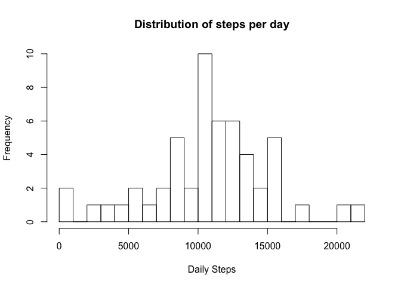
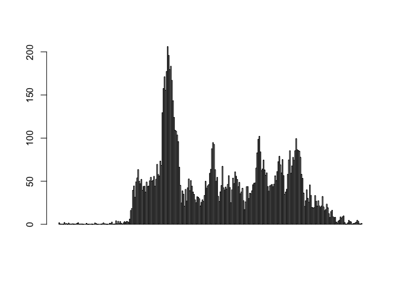
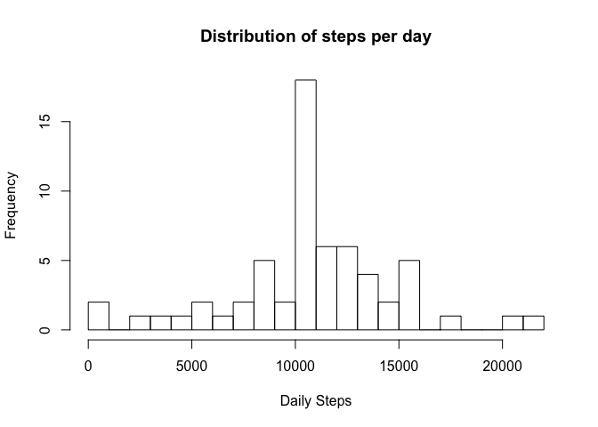
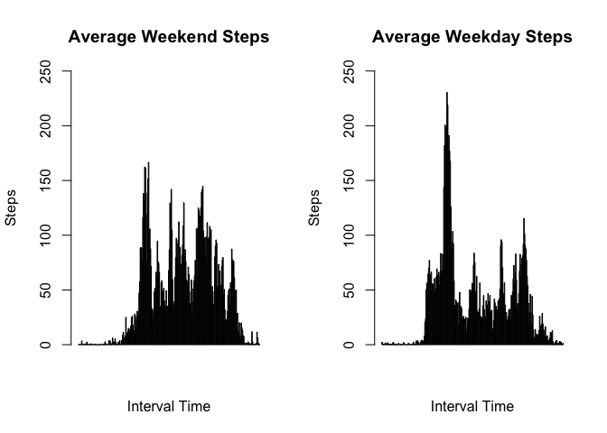

##Loading and Processing the Data
Data for this report is stored as a zipped csv file on an external server. The following R code will download and read this file into an object in the global environment.


```r
temp <- tempfile()
download.file("https://d396qusza40orc.cloudfront.net/repdata%2Fdata%2Factivity.zip", temp)
activity_data <- read.csv(unz(temp, "activity.csv"))
rm(temp)
```

##Daily Step Activity - Distribution, Mean, and Median
The first prompt asks questions about the distribution, mean, and median of daily steps recorded. Since the original dataset stores the number of steps in five minute increments, we must first aggregate the data by date to see daily activity. From there, it is simple to plot a histogram to see distribution of daily steps and to calculate the median and mean.


```r
daily_activity <- aggregate(steps ~ date, activity_data, sum)
hist(daily_activity$steps, main = "Distribution of steps per day", xlab = "Daily Steps", ylab = "Frequency", breaks = 20)
```

<!-- -->

```r
with(daily_activity, data.frame("Mean" = mean(steps, na.rm = TRUE), "Median" = median(steps, na.rm = TRUE)))
```

```
##       Mean Median
## 1 10766.19  10765
```

##Interval Step Activity - Peak Activity
The second prompt asks about the average peak activity within the five minute intervals for each day. To understand this, we first aggregate the data by interval using the mean function; this will give us the average number of steps for each five minute period in a day. If we graph this as a barplot, we can see some interesting trends. There is a long stretch of inactivity during the first part of the day, presumably when the subject is sleeping in the early morning, followed by a peak of activity late in the morning, steady activity in the afternoon, and lower activity in the evening. We can find the five minute interval with the most activity by using the max function.  
  
The 104th period, or minute 835, has the highest average steps at 206.


```r
interval_activity <- aggregate(steps ~ interval, activity_data, mean)
barplot(interval_activity$steps)
```

<!-- -->

```r
interval_activity[interval_activity$steps == max(interval_activity$steps, na.rm = TRUE), ]
```

```
##     interval    steps
## 104      835 206.1698
```

##Missing Values
Let's see how many rows have missing values:

```r
sum(is.na(activity_data$steps))
```

```
## [1] 2304
```

In this prompt, we are asked to determine if the missing values creates bias in the analysis. I've chosen to replace missing values with the mean average for the time interval, then re-examine the histogram, mean, and median by day.


```r
activity_data2 <- transform(activity_data, steps = ifelse(is.na(steps), ave(steps, interval, FUN = function(x) mean(x, na.rm = TRUE)), steps))
daily_activity2 <- aggregate(steps ~ date, activity_data2, sum)
hist(daily_activity2$steps, main = "Distribution of steps per day", xlab = "Daily Steps", ylab = "Frequency", breaks = 20)
```

<!-- -->

```r
with(daily_activity2, data.frame("Mean" = mean(steps, na.rm = TRUE), "Median" = median(steps, na.rm = TRUE)))
```

```
##       Mean   Median
## 1 10766.19 10766.19
```
Okay, not very different.

##Weekdays and Weekends
In this prompt we need to differentiate activity between weekends and weekdays, and examine the data by interval. We do this by adding a variable to the dataset where we replaced NAs that uses the date variable to determine the day of week. Then, we create a panel plot comparing average steps per interval on weekdays vs weekends.

```r
activity_data2$wkday <- weekdays(as.POSIXct(activity_data2$date))
activity_data2$daytype <- with(activity_data2, ifelse(wkday == "Saturday" | wkday == "Sunday", "Weekend", "Weekday"))
interval_daytype <- aggregate(steps ~ interval*daytype, activity_data2, mean)
interval_weekdays <- subset(interval_daytype, daytype == "Weekday")
interval_weekend <- subset(interval_daytype, daytype == "Weekend")
par(mfrow = c(1,2))
barplot(interval_weekend$steps, main = "Average Weekend Steps", xlab = "Interval Time", ylab = "Steps", ylim = c(0,250))
barplot(interval_weekdays$steps, main = "Average Weekday Steps", xlab = "Interval Time", ylab = "Steps", ylim = c(0,250))
```

<!-- -->
end
